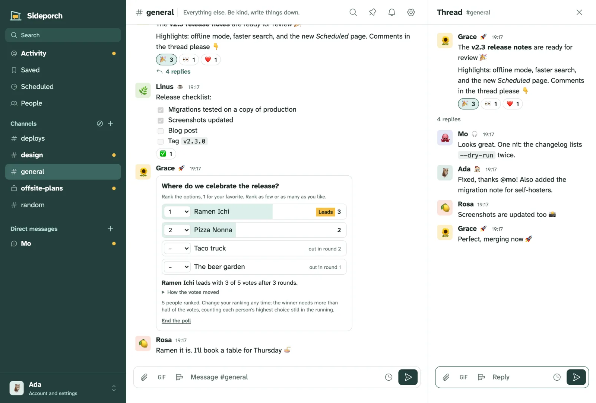
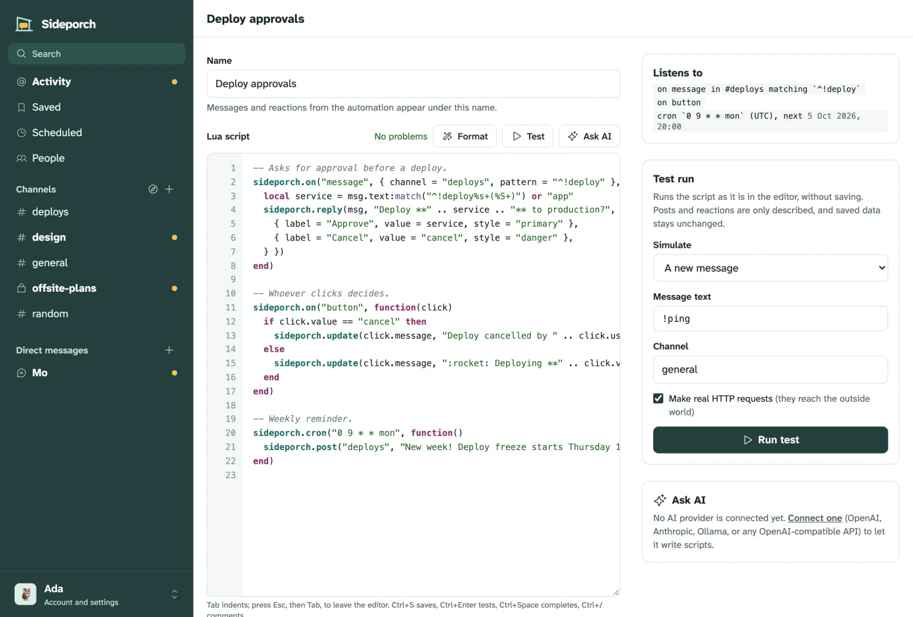

<p align="center"></p>

<h1 align="center">Sideporch</h1>

<p align="center"><strong>A small, self-hosted team chat in one binary.</strong><br>
Channels, threads and direct messages for a team, a club or a family,<br>
with the things people miss from Slack, on a server you control.</p>

<p align="center">
<a href="https://sideporch.app">Website</a> ·
<a href="https://sideporch.app/docs/">Documentation</a> ·
<a href="#try-it">Try it</a> ·
<a href="#install">Install</a> ·
<a href="#features">Features</a>
</p>

<picture>
  <source media="(prefers-color-scheme: dark)" srcset="website/static/img/channel-dark.webp">
  
</picture>

> **Status:** early. It works end to end, but expect rough edges and breaking changes before 1.0.

## Why Sideporch

- **Yours, and simple to run.** One program and one data directory. No database server, no mail server required, nothing else to install. It runs on a small VPS, a home server or an ARM board.
- **Familiar.** Channels, threads, mentions, reactions, search and notifications work the way people know from Slack, and you can bring your Slack history along.
- **Easy to back up and move.** Everything lives in one directory; download a complete backup from the browser, or have Sideporch write one every day.
- **Works with your tools.** Monitors, CI and bots post through Slack-compatible webhooks, so tools like [Gatus](https://gatus.io/) and Grafana work unchanged. Automations in Lua do the rest.

## Try it

With Docker:

```sh
docker run -d -p 8080:8080 -v sideporch:/data ghcr.io/niklas-heer/sideporch
```

Or with Homebrew on macOS and Linux:

```sh
brew install niklas-heer/tap/sideporch
sideporch
```

Open <http://localhost:8080> (or <http://127.0.0.1:8080> for the Homebrew version). The first person to open it creates the admin account. Then invite everyone else from **People** with an invite link; nobody needs an email address.

## Install

On a server, use the install script. It picks the build for your system, checks it against the release's checksums, and installs one file:

```sh
curl -fsSL https://raw.githubusercontent.com/niklas-heer/sideporch/main/install.sh | sh
```

Docker, Homebrew, Nix and NixOS work too. The documentation walks through [installing](https://sideporch.app/docs/get-started/install/), [running it on a server](https://sideporch.app/docs/get-started/run-on-a-server/) with systemd and HTTPS, and [updating](https://sideporch.app/docs/get-started/update/).

## Features

- **Chat the way your team already does**: public and private channels, threads, direct messages, Markdown with diagrams, reactions, custom emoji, GIFs, files, link previews, pins and announcement channels. [Chatting](https://sideporch.app/docs/using/chatting/)
- **Polls** where people pick one, pick several, or rank the options to find what most can live with. [Polls](https://sideporch.app/docs/using/polls/)
- **Search** with filters like `from:`, `in:` and `has:file`, that corrects typos from your own team's words. [Search](https://sideporch.app/docs/using/search/)
- **Activity, saved messages, reminders and send later.** [Keeping up](https://sideporch.app/docs/using/keeping-up/)
- **On phones**: installs like an app, with push notifications straight from your server. [Phones](https://sideporch.app/docs/using/phones/)
- **Read aloud and dictate** in dozens of languages, with models that run on your server. [Speech](https://sideporch.app/docs/using/read-aloud-and-dictation/)
- **20 themes**, profiles and keyboard shortcuts. [Themes](https://sideporch.app/docs/using/themes-and-profiles/)
- **For public communities**: open sign-up, trust levels, roles, permissions and moderation. [Sign-up and trust](https://sideporch.app/docs/community/sign-up-and-trust/)
- **Passkeys, authenticator apps and email sign-in links**, with a policy for what signing in takes. [Sign-in](https://sideporch.app/docs/community/sign-in-security/)
- **Updates you hear about**, security fixes first, installed from the browser or by Sideporch itself, and only when signed. [Updating](https://sideporch.app/docs/get-started/update/)
- **Backups** from the browser or on a schedule, and **import from Slack**. [Backups](https://sideporch.app/docs/community/backups/)
- **Webhooks and Lua automations**, written and tested in the browser, or by AI through MCP. [Automations](https://sideporch.app/docs/integrations/automations/)
- **Small**: half a CPU and 512 MB served 4,800 people online at once in load tests. [How big a server](https://sideporch.app/docs/community/server-size/)



## Documentation

<a name="a-tour"></a><a name="run-it"></a><a name="update"></a><a name="back-up-and-move"></a><a name="move-from-slack"></a><a name="connect-gatus-and-other-tools"></a><a name="automations"></a><a name="let-ai-write-automations"></a><a name="how-big-a-server"></a><a name="good-to-know"></a>
Everything else lives at **[sideporch.app/docs](https://sideporch.app/docs/)**: [running it](https://sideporch.app/docs/get-started/run-on-a-server/), [updates](https://sideporch.app/docs/get-started/update/), [backups and moving](https://sideporch.app/docs/community/backups/), [moving from Slack](https://sideporch.app/docs/community/move-from-slack/), [webhooks for Gatus and other tools](https://sideporch.app/docs/integrations/incoming-webhooks/), [automations](https://sideporch.app/docs/integrations/automations/) and [their API](https://sideporch.app/docs/integrations/automation-api/), [AI and MCP](https://sideporch.app/docs/integrations/ai-and-mcp/), [how big a server](https://sideporch.app/docs/community/server-size/) and [what Sideporch deliberately isn't](https://sideporch.app/docs/get-started/what-is-sideporch/#good-to-know).

## Develop

Tool versions and tasks live in `mise.toml`:

```sh
mise run dev           # run locally with data in ./data
mise run check         # formatting, Clippy, unit and end-to-end tests
mise run ci            # the Linux CI pipeline in containers, through Dagger
mise run build-static  # static Linux binaries with zig and musl
mise run image         # build the container image and load it into Docker
mise run site          # preview the website and docs at http://127.0.0.1:1111
```

The website and its documentation live in `website/`, built with [Zola](https://www.getzola.org): `mise run site` previews them, and `mise run screenshots` retakes every screenshot. See [website/README.md](website/README.md).

CI runs through [Dagger](https://dagger.io) (`.dagger/main.dang`); the GitHub workflows only call it. Pushing a `vX.Y.Z` tag that matches `Cargo.toml` builds, tests and publishes a release, its container images, and the checksums that the Homebrew formula and `install.sh` verify.

The web interface is rendered on the server with [maud](https://maud.lambda.xyz). Styles are Tailwind-style utility classes compiled at build time by [encre-css](https://gitlab.com/encre-org/encre-css), a Rust implementation of Tailwind, so there is no Node toolchain. `assets/app.js` is the main page script, `assets/editor.js` powers the automation editor, and `assets/sw.js` shows push notifications.

## Decisions

Lasting choices are recorded in [decisions/](decisions/) using [vrdx](https://github.com/niklas-heer/vrdx).

## License

[MIT](LICENSE). Diagrams are drawn by the embedded [Mermaid](https://mermaid.js.org) (MIT; see `assets/vendor/README.md`). Icons are from [Phosphor](https://phosphoricons.com) (MIT). The embedded [Atkinson Hyperlegible Next](https://github.com/googlefonts/atkinson-hyperlegible-next) font is under the [SIL Open Font License](assets/fonts/OFL.txt).
