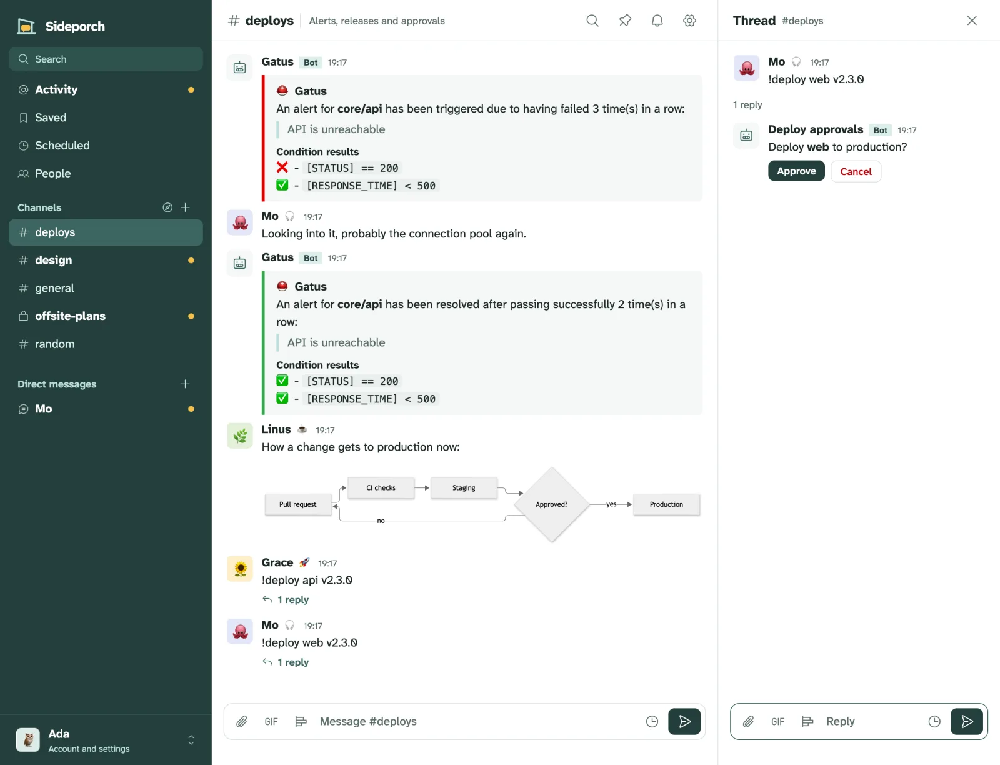
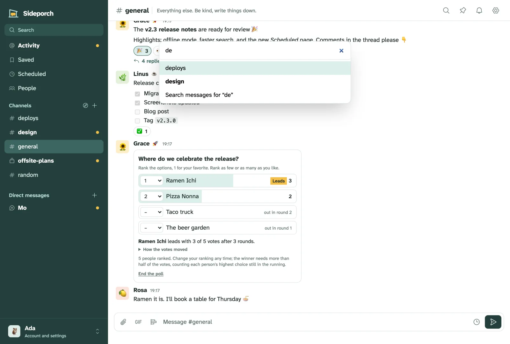
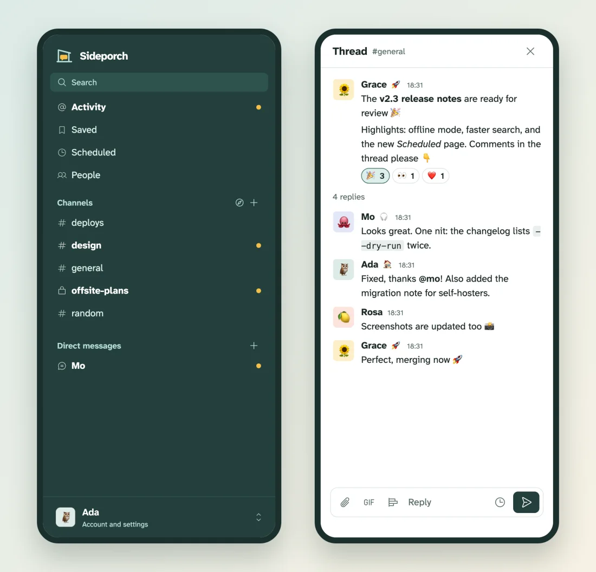

<p align="center"></p>

<h1 align="center">Sideporch</h1>

<p align="center"><strong>A small, self-hosted team chat in one binary.</strong><br>
Channels, threads and direct messages for a team, a club or a family,<br>
with the things people miss from Slack, on a server you control.</p>

<p align="center">
<a href="#try-it">Try it</a> ·
<a href="#a-tour">Tour</a> ·
<a href="#install">Install</a> ·
<a href="#automations">Automations</a> ·
<a href="#good-to-know">Good to know</a>
</p>

<picture>
  <source media="(prefers-color-scheme: dark)" srcset="docs/screenshots/channel-dark.webp">
  
</picture>

> **Status:** early. It works end to end, but expect rough edges and breaking changes before 1.0.

## Why Sideporch

- **Yours, and simple to run.** One program and one data directory. No database server, no email server, nothing else to install. It runs on a small VPS, a home server or an ARM board.
- **Familiar.** Channels, threads, mentions, reactions, search and notifications work the way people know from Slack, and you can bring your Slack history along.
- **Easy to back up and move.** Everything lives in one directory; download a complete backup from the browser, or have Sideporch write one every day.
- **Works with your tools.** Monitors, CI and bots post through Slack-compatible webhooks, so tools like [Gatus](https://gatus.io/) and Grafana work unchanged. Automations in Lua do the rest.

## Try it

With Docker:

```sh
docker run -d -p 8080:8080 -v sideporch:/data ghcr.io/niklas-heer/sideporch
```

Or with Homebrew on macOS and Linux:

```sh
brew install niklas-heer/tap/sideporch
sideporch
```

Open <http://localhost:8080> (or <http://127.0.0.1:8080> for the Homebrew version). The first person to open it creates the admin account. Then invite everyone else from **People** with an invite link; nobody needs an email address. To run it for real, see [Install](#install) and [Run it](#run-it).

## A tour

### Chat the way your team already does

- Public channels anyone can join, **private channels** for the people you add, direct messages, and **threads**.
- Messages appear live, with unread markers in the sidebar and **someone is typing…** under the box.
- **Markdown** as on GitHub: bold and italics, lists and task lists, tables, code blocks, quotes, links, `@mentions`, `:emoji:`, and diagrams drawn from [Mermaid](https://mermaid.js.org) code blocks.
- **Reactions** with every emoji, **custom emoji** anyone can add, **GIFs** from the team's own library (or GIPHY or KLIPY, if an admin sets them up), **files and images** you paste or drop in, and **link previews**.
- **Polls**: `/poll Where do we eat? | Pizza | Tacos`.
- **Edit and delete** your messages (press ↑ in an empty box to edit your last one), and **pin** the important ones to the channel. Admins can limit editing to a while after sending; by default there's no limit.
- **Announcement channels**: let only a channel's managers start posts, while everyone else replies in threads and reacts, or limit replies and reactions too.



### Stay on top of things

- **Activity** collects mentions and replies to threads you're in. **Saved** keeps messages you want to come back to.
- **Reminders**: `/remind me tomorrow to water the plants`, or *Remind me* in any message's menu. They arrive as a message to yourself, in your own time zone.
- **Send later**: the clock next to Send schedules a message; **Scheduled** lists what's waiting.
- **Search** every channel and conversation you're in.
- **Push notifications** for direct messages, mentions and thread replies, straight from your server. Mute noisy channels; leave the ones you don't need.
- **Keyboard shortcuts**:

  | Keys | What they do |
  | --- | --- |
  | ⌘K (Ctrl+K) | Jump to any channel, person or page |
  | Alt+↑ / Alt+↓ | Previous or next channel; add Shift for unread ones |
  | ↑ | Edit your last message |
  | Esc | Close the thread |
  | ⌘/ (Ctrl+/) | Show all shortcuts |



### On your phone

Sideporch works in any mobile browser, and installs as an app: its own icon and window, the number of unread conversations on the icon, and on Android a place in the share sheet, so links and text from other apps go straight into a conversation. When the connection drops, it says so instead of showing an error page.

**Get notifications on your phone.** Your server needs HTTPS (see [Run it](#run-it)). Then:

- **iPhone and iPad** (iOS 16.4 or newer): open Sideporch in Safari, tap **Share**, then **Add to Home Screen**. Open it from the home screen and tap **Turn on** in the hint at the bottom of the sidebar, or **Notifications** in your account menu (your name at the bottom of the sidebar). iOS only lets installed web apps send notifications, so this step is needed.
- **Android**: open Sideporch in Chrome or Firefox and tap **Turn on**, or **Notifications** in your account menu. Installing it (**Install** in the hint, or *Add to Home screen*) is optional but gives it its own window.

Notifications cover direct messages, mentions and replies in your threads, and skip the ones you're already looking at. Each device turns them on separately. Sideporch sends them itself through the browsers' push services, so no app store account is involved; your server only needs to reach the internet.

<p align="center"></p>

### Themes, profiles and people

Pick one of 20 popular themes, such as GitHub, Solarized, Gruvbox, Catppuccin, Nord, Dracula or High contrast, light, dark or following your system; admins set the team's default. Everything about your account is one click away under your name at the bottom of the sidebar.

Everyone has a profile with a picture, a status, a bio and links, and picks the emoji their reaction picker shows first. Admins invite people with links, make others admins, create password reset links (no email needed), and deactivate accounts of people who leave.

### Automate the busywork

Admins write small **Lua scripts** in the browser that react to messages and reactions, run on a schedule, answer `/commands` and webhooks, call other services' APIs with encrypted secrets, and put buttons under their messages, for approvals and the like. The editor checks and formats the code, runs tests without touching anything, and keeps every version. An AI model can write scripts for you, in the editor or from your own agent through [MCP](https://modelcontextprotocol.io). [More below](#automations).


### For admins

- **Backups** from the browser, on a schedule, and `sideporch restore`. See [Back up and move](#back-up-and-move).
- **Import from Slack**. See [Move from Slack](#move-from-slack).
- A **system page** with CPU and memory over the last minutes, database and file sizes, free disk space and activity.
- Settings for GIFs and link previews.

## Install

Every release has prebuilt binaries for Linux and macOS, on x86-64 and ARM64. The Linux binaries are fully static: they need no libc or any other library, so they run on any distribution.

```sh
# Script: detects your system, verifies the checksum, installs to /usr/local/bin or ~/.local/bin
curl -fsSL https://raw.githubusercontent.com/niklas-heer/sideporch/main/install.sh | sh

# Homebrew (macOS and Linux)
brew install niklas-heer/tap/sideporch

# Docker: a small image with nothing but the binary
docker run -d -p 8080:8080 -v sideporch:/data ghcr.io/niklas-heer/sideporch

# Nix
nix run github:niklas-heer/sideporch
```

On NixOS, the flake provides a module: import `sideporch.nixosModules.default` and set `services.sideporch.enable = true;`. You can also build from source with `cargo build --release`.

## Run it

```sh
sideporch --data /var/lib/sideporch --public-url https://chat.example.com
```

Then open Sideporch in your browser. While no account exists, the first visitor creates the admin account; after that, new people need an invite link from **People**. No email is needed.

If others can reach the server before you set it up, start it with `--require-setup-link`. Setup then needs a one-time link that stays out of service and container logs. Get it on the server:

```sh
sideporch setup-link --data /var/lib/sideporch
docker exec <container> /sideporch setup-link
```

| Option | Environment variable | Default | Meaning |
| --- | --- | --- | --- |
| `--listen` | `SIDEPORCH_LISTEN` | `127.0.0.1:8080` | Address and port to listen on. |
| `--data` | `SIDEPORCH_DATA` | `sideporch-data` | Directory for the SQLite database. |
| `--public-url` | `SIDEPORCH_PUBLIC_URL` | derived from requests | The URL people use, for invite and webhook links. An `https://` URL also turns on secure cookies. |
| `--require-setup-link` | `SIDEPORCH_REQUIRE_SETUP_LINK` | off | Require the one-time link from `sideporch setup-link` to create the first account. |

Put Sideporch behind a reverse proxy for HTTPS; browsers only allow push notifications and installing Sideporch as an app over HTTPS. With [Caddy](https://caddyserver.com), this is the whole configuration, and it passes the WebSocket that live updates use:

```
chat.example.com {
	reverse_proxy 127.0.0.1:8080
}
```

Other proxies need to pass WebSocket upgrades for `/ws`.

### Update

Install the new version (`brew upgrade sideporch`, `docker pull`, or the install script again) and restart Sideporch. That's all, even when you skip several versions: on start, Sideporch applies every database change between the version you ran and the new one, in order, each in its own transaction, so an interrupted upgrade picks up where it stopped.

Before it changes the database, Sideporch keeps a copy of it in `upgrade-backups/` in the data directory (the newest three). To go back, stop Sideporch, restore the copy and start the version you ran before:

```sh
sideporch restore sideporch-data/upgrade-backups/sideporch-schema17-20261001-080000.db --data sideporch-data --force
```

An older version refuses to start on a database a newer one has already updated, and names the version that did, rather than guessing at tables it doesn't know. Release notes for each version are on the [releases page](https://github.com/niklas-heer/sideporch/releases).

### Back up and move

Everything lives in the data directory: the SQLite database `sideporch.db`, uploaded files and pictures in `files/` (named by their SHA-256, so they never change once written), and `secret.key`, which decrypts stored secrets.

The simplest way is **Admin → Backups**: download one archive with all of it while Sideporch keeps running, or let Sideporch write backups on a schedule to a directory (ideally another disk or a mounted volume) and keep the newest few. To restore, stop Sideporch and unpack an archive into an empty data directory:

```sh
sideporch restore sideporch-20260928-101500.tar.gz --data /path/to/data
```

You can also stop Sideporch and copy the directory. To back up while it runs, copy the database with `sqlite3 sideporch-data/sideporch.db ".backup backup.db"` and then the rest of the directory, for example with rsync or restic; files are only ever added, so copying them after the database is safe. [Litestream](https://litestream.io) can replicate the database continuously; back up `files/` and `secret.key` alongside it.

Sideporch 0.1 and 0.2 kept uploads inside the database. Newer versions move them to `files/` on the first start and then compact the database.

### Move from Slack

In Slack, export your workspace (*Workspace settings → Import/Export Data*). In Sideporch, upload the ZIP under **Admin → Import**. People, public and private channels, direct messages, threads and reactions come over; people who already have an account are matched by username, and the others get accounts without a password, so send each of them a reset link from their profile. Files stay in Slack, since Slack keeps them behind its login; messages name them instead. Importing the same export again only adds what's new.

## Connect Gatus and other tools

**Incoming webhooks** let tools post into a channel. In the channel, open the settings (the gear icon) and create a webhook, then copy its URL into the tool. For Gatus:

```yaml
alerting:
  slack:
    webhook-url: "https://chat.example.com/hooks/<token>"
```

Gatus's `mattermost` provider works too. Its `channel` setting posts to another public channel by name, and `username` and `icon_url` set the sender. Any tool that posts Slack-style `text` and `attachments` works the same way.

**Outgoing webhooks** send people's messages from a channel to another service, like Slack's and Mattermost's. Add one in the channel settings with a URL and, optionally, trigger words such as `!deploy`; then only messages starting with one go out. Sideporch posts JSON with the text, the author, the channel and a `token` to check. If the service answers with JSON that has `text`, Sideporch posts it in the channel, or in the thread with `"response_type": "comment"`. For anything more involved, write an [automation](#automations).

## Automations

Admins write automations in Lua under the lightning icon in the sidebar. Like Slack workflows, each one says what should happen when something happens, but with a real language:

```lua
-- Events, narrowed down with filters.
sideporch.on("message", { channel = "alerts", pattern = "^!ack" }, function(msg)
  sideporch.react(msg, "white_check_mark")
end)

sideporch.on("member_joined", function(event)
  sideporch.post("general", "Welcome to the porch, " .. event.user .. "!")
end)

-- Schedules, in cron syntax and your time zone.
sideporch.cron("0 9 * * mon-fri", function()
  sideporch.post("standup", "Good morning! What are you working on today?")
end)

-- Slash commands, answered privately.
sideporch.command("weather", { description = "Today's weather", usage = "<city>" }, function(cmd)
  local weather = require("weather") -- a library, see below
  local today = weather.today(cmd.args[1] or "Berlin")
  sideporch.respond(cmd, "**" .. today.summary .. "**, " .. today.temperature .. " °C")
end)

-- Webhooks: each automation has its own URL.
sideporch.on_webhook(function(request)
  sideporch.post("deploys", "Deploying **" .. request.json.service .. "**")
  return { json = { ok = true } }
end)
```

- **Events**: `message`, `message_changed`, `message_deleted`, `reaction_added`, `reaction_removed`, `member_joined` and `channel_created`, with filters for the channel, a text pattern, the emoji, the person, and threads. Automations see public channels only.
- **Buttons**: `sideporch.post` and `sideporch.reply` can put up to five buttons under a message; clicks arrive as `button` events for that automation, which can change its message with `sideporch.update`, for approvals and the like.
- **Schedules**: `sideporch.cron` with standard five-field expressions (`*/15 * * * *`, `@daily`, `mon-fri`) in the instance's time zone or one you name, and `sideporch.every(seconds, …)`.
- **Slash commands**: `/name` in any channel runs the automation that registered it. Answers from `sideporch.respond` are visible only to the person who typed the command; `/help` lists all commands, and the composer suggests them.
- **Outgoing HTTP**: `sideporch.http.get`, `.post` and `.request` call APIs and parse JSON. Requests to private, loopback and link-local addresses are refused unless an admin allows them under *Settings*, so scripts cannot probe the server's network.
- **Secrets**: API tokens live under *Secrets*, encrypted in the database with a key kept outside it (`secret.key` in the data directory, or `SIDEPORCH_SECRET_KEY`). Environment variables named `SIDEPORCH_SECRET_<NAME>` work too. Scripts read them with `sideporch.secret("NAME")`, and their values are hidden in run logs.
- **Libraries**: a library is shared code, for example a client for an API, that automations load with `require("name")`.
- **Data and messages**: `sideporch.get`/`set` keep data between runs, `sideporch.json` reads and writes JSON, and messages are GitHub-flavored Markdown.

Each automation runs on its own thread in a sandbox, with limits on instructions, memory, posts and requests per run, and no file or process access. The editor lists the full API.

The editor is made for writing and debugging automations:

- Syntax highlighting, completions for the `sideporch` API, and auto-indentation.
- A linter ([selene](https://github.com/Kampfkarren/selene)) that knows the sandbox, and a formatter ([StyLua](https://github.com/JohnnyMorganz/StyLua)).
- **Test runs** against a simulated message, reaction, command, webhook request, schedule, new member or new channel. They show what the script prints, posts and answers, without changing anything in Sideporch.
- What each automation **listens to**, with its next scheduled runs, a **run log**, a **history** of every saved version with one-click restore, and its **webhook URL**.

Scripts, libraries, their history and their data all live in the SQLite database, so a backup of it covers automations too. Keep `secret.key` with it.

### Let AI write automations

- **In the editor**: an admin connects a model under *Automations → AI provider*, either Anthropic's API or any OpenAI-compatible one (OpenAI, OpenRouter, Ollama, …). Then *Ask AI* writes or changes the script from a description, using your libraries. Sideporch lints and test-loads the answer, sends problems back to the model, and shows the result for review; nothing is saved until you choose to.
- **From your own agent**: Sideporch is an [MCP](https://modelcontextprotocol.io) server at `/mcp`. Create a token under *Automations → MCP*, then connect, for example with Claude Code:

  ```sh
  claude mcp add --transport http sideporch https://chat.example.com/mcp \
    --header "Authorization: Bearer sp_…"
  ```

  Agents get what a developer needs: the API reference, channels and recent messages, lint, format, dry-run tests and live runs, run logs, versions and restore, saved data, write-only secrets, settings, and cron previews. Scripts are also available as MCP resources. Automations an agent creates start switched off, and every change is kept in the history under the token's name.

## How big a server?

Small. Load tests had everyone online at once, each posting every two minutes, and a message counted only when it reached everyone within a second:

| Server | People online at once |
| --- | ---: |
| ½ CPU, 512 MB | 4,800 |
| 1 CPU, 1 GB | 9,600 |
| 2 CPUs, 2 GB | 12,800 or more |

Real servers are often slower than the test machine, so plan with a quarter of that: the smallest VPS or a Raspberry Pi is plenty for a thousand people online. Memory stays around 20 KB per connected person. [How many people can Sideporch handle?](docs/capacity.md) has the method, all results, and how to run the tests yourself.

## Good to know

- **It's for teams, not enterprises.** Sideporch runs on one server with SQLite. That is plenty for a team, a club, a company of a few thousand or a family, but not built for organisations of tens of thousands.
- **The server can read everything.** Messages are not end-to-end encrypted. Whoever runs the server, and admins through backups, can read all of them. Use HTTPS.
- **No calls, no email.** There are no voice or video calls, and notifications are push notifications, not email.
- **No group direct messages.** Make a private channel instead.
- **Automations only see public channels**, never private channels or direct messages.

## Develop

Tool versions and tasks live in `mise.toml`:

```sh
mise run dev           # run locally with data in ./data
mise run check         # formatting, Clippy, unit and end-to-end tests
mise run ci            # the Linux CI pipeline in containers, through Dagger
mise run build-static  # static Linux binaries with zig and musl
mise run image         # build the container image and load it into Docker
```

CI runs through [Dagger](https://dagger.io) (`.dagger/main.dang`); the GitHub workflows only call it. Pushing a `vX.Y.Z` tag that matches `Cargo.toml` builds, tests and publishes a release, its container images, and the checksums that the Homebrew formula and `install.sh` verify.

The web interface is rendered on the server with [maud](https://maud.lambda.xyz). Styles are Tailwind-style utility classes compiled at build time by [encre-css](https://gitlab.com/encre-org/encre-css), a Rust implementation of Tailwind, so there is no Node toolchain. `assets/app.js` is the main page script, `assets/editor.js` powers the automation editor, and `assets/sw.js` shows push notifications.

## Decisions

Lasting choices are recorded in [decisions/](decisions/) using [vrdx](https://github.com/niklas-heer/vrdx).

## License

[MIT](LICENSE). Diagrams are drawn by the embedded [Mermaid](https://mermaid.js.org) (MIT; see `assets/vendor/README.md`). Icons are from [Phosphor](https://phosphoricons.com) (MIT). The embedded [Atkinson Hyperlegible Next](https://github.com/googlefonts/atkinson-hyperlegible-next) font is under the [SIL Open Font License](assets/fonts/OFL.txt).
